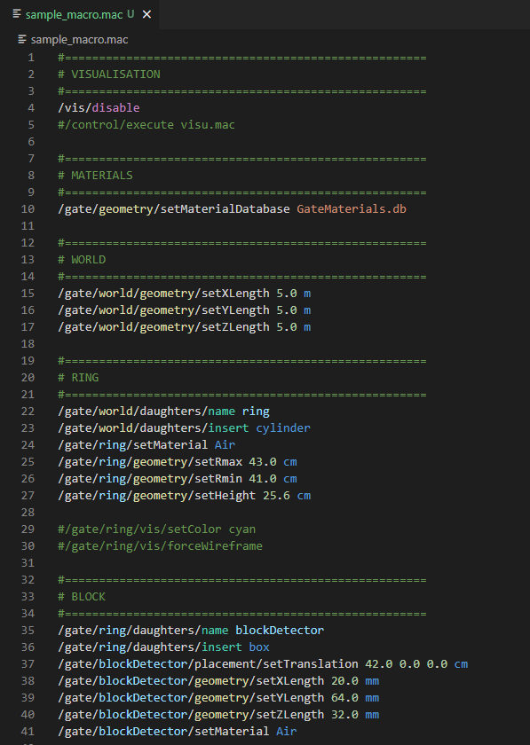

# gate-colors

Rudimentary VSCode extension to add syntax highlighting to GATE macro files (.mac). Recommended for use with the Dark+ color theme, available by default in VSCode.

## About GATE
GATE is a wrapper of the popular Monte Carlo simulation code GEANT4 that uses programmatic macro file inputs to offer a more user friendly experience. It is particularly designed with medical imaging simulations in mind. More information can be found here: 
> https://opengate.readthedocs.io/en/latest/introduction.html 

## Features

- Provides basic syntax highlighting compatible with default VSCode color themes:
    - Comments
    - Constants, numbers, and materials
    - Units
    - Top-level Gate tree commands (```world```, ```systems```, ```geometry```, etc.)
    - User-defined variables (e.g. names of volumes)
    - User-defined file inputs and outputs
    - High-level structural keywords (```/name```, ```/insert```, ```/attach```)
    - High-level flow keywords (```initialize```, ```disable```, ```start```)
- Additionally, supports line- and multi-line commenting with VSCode's comment keybind.



<!-- ## Requirements

If you have any requirements or dependencies, add a section describing those and how to install and configure them. -->

<!-- ## Extension Settings -->

<!-- Include if your extension adds any VS Code settings through the `contributes.configuration` extension point.

For example:

This extension contributes the following settings:

* `myExtension.enable`: Enable/disable this extension.
* `myExtension.thing`: Set to `blah` to do something. -->

## Installation
Please refer to ```vsc-extension-quickstart.md``` for detailed instructions.
- Download / clone this repository and open in VSCode.
- Press `F5` to open a new window with your extension loaded.
- `.mac` files opened in the new window will have the syntax highlighting applied.

## Changing your color theme in VSCode
The default dark-mode color theme in VSCode is Dark (Visual Studio). This does not include quite as many color scopes as some of the others. We highly recommend using Dark+ with this extension. 

You can change your color theme in VSCode with **File** > **Preferences** > **Theme** > **Color Theme**, or press ```Ctrl-Shift-P``` and search for **Preferences > Color Theme**.

## Known Issues
- All materials and units are manually hard-coded. Syntax highlighting of user-defined materials and units is not currently available.
- Semantic highlighting (https://code.visualstudio.com/api/language-extensions/semantic-highlight-guide) is not innately included and will overwrite any of the syntax highlighting used here.
    - The current implementation of variable highlighing (```/gate/myVolumenName/```) is a hacky way of creating a semantic highlighting illusion. In fact, any "secondary" item after ```gate``` will be highlighted.

## Release Notes


### 1.0.0
- (2023/10/09) Initial release
